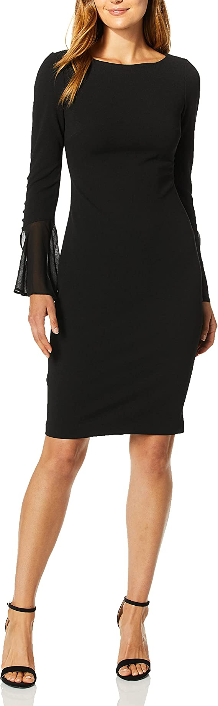

### First way : using function, not using class selector
```html
<!DOCTYPE html>
<html lang="en">

<head>
    <meta charset="UTF-8">
    <meta http-equiv="X-UA-Compatible" content="IE=edge">
    <meta name="viewport" content="width=device-width, initial-scale=1.0">
    <title>Document</title>
    <link rel="stylesheet" href="style.css">
</head>

<body>

    <h2>Product Color Change</h2>


    <div class="container">

        <div class="select-img">
            <div class="img1-div">
                
            </div>
            <div class="img2-div">
                
            </div>
            <div class="img3-div">
                
            </div>
        </div>
        
        <div class="main-img">
            <div class="main-img-box">
                
            </div>
        </div>
    </div>


    <script>
        function myFunction(clickImg){
            let mainImgId = document.getElementById("main-img-id");
            mainImgId.src = clickImg.src;
        }
    </script>
</body>


</html>

```


---
---


### Second way : using class selector, not using function

```html
<!DOCTYPE html>
<html lang="en">

<head>
    <meta charset="UTF-8">
    <meta http-equiv="X-UA-Compatible" content="IE=edge">
    <meta name="viewport" content="width=device-width, initial-scale=1.0">
    <title>Document</title>
    <link rel="stylesheet" href="style.css">
</head>

<body>

    <h2>Product Color Change</h2>


    <div class="container">

        <div class="select-img">
            <div class="img1-div">
                
            </div>
            <div class="img2-div">
                
            </div>
            <div class="img3-div">
                
            </div>
        </div>
        
        <div class="main-img">
            <div class="main-img-box">
                
            </div>
        </div>
    </div>


    <script>
        let myImg = document.querySelectorAll('.myImg');
        let mainImgId = document.getElementById("main-img-id");

        myImg.forEach((img) => {
            img.addEventListener('click',function(){
                // console.log(img);
                mainImgId.src = img.src;
            })
        })
    </script>
</body>


</html>


```


---
---


```css
* {
    margin: 0;
    padding: 0;
    box-sizing: border-box;
}

h2 {
    margin-top: 10px;
    text-align: center;
    color: brown;
    font-weight: 900;
    letter-spacing: 3px;
}

h2:hover {
    color: blueviolet;
}

.container {
    width: 90%;
    margin: 2% auto;

    display: flex;
}

.select-img{
    flex-basis: 40%;
    max-height: 500px;

    display: flex;
    flex-direction: column;
    justify-content: center;
    align-items: end;
}

.select-img > div {
    height: 100px;
    width: 100px;
    margin: 5%;
}

.img1,
.img2,
.img3 {
    width: 100%;
    height: 100%;
    object-fit: fill;
    border: 2px solid blue;
    cursor: pointer;
    border-radius: 5px;
    opacity: 0.7;
}

.img1:hover,
.img2:hover,
.img3:hover {
    border: 2px solid blueviolet;
    border-radius: 5px;
    opacity: 1;
}

.main-img {
    flex-basis: 60%;
    max-height: 500px;
    /* border: 2px solid green; */
}

.main-img-box {
    width: 400px;
    height: 400px;
    margin: 5%;
    /* background: lightcyan; */
    border: 2px solid blue;
}

.main-img-box > .img4 {
    width: 100%;
    height: 100%;
    object-fit: contain;
}
```


